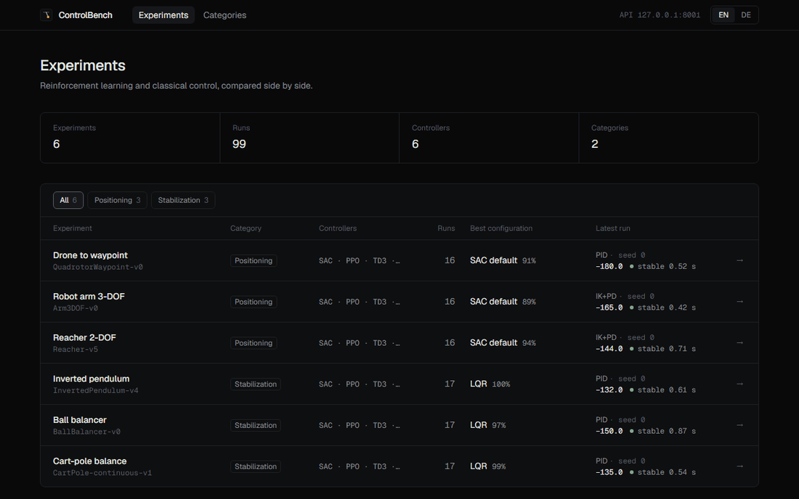
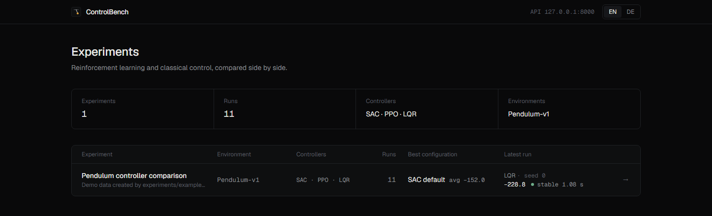
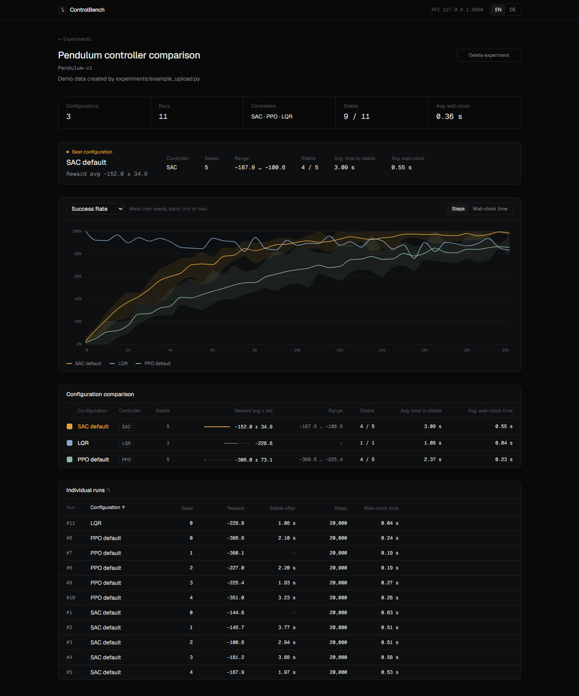
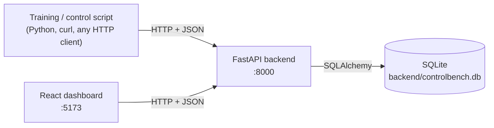

# ControlBench

[](https://github.com/maximilian467/ControlBench/actions/workflows/ci.yml)
[](LICENSE)


**Compare learned and classical controllers under the same conditions.**

ControlBench is a local experiment tracker and benchmarking dashboard for reinforcement learning and classical control. Training and control scripts send their results to a small REST API; the dashboard groups runs into configurations and compares them over multiple seeds, with averaged learning curves over environment steps or wall-clock time. Everything runs on your machine, backed by a single SQLite file. No account and no cloud needed.

> **Status: early development / public preview (v0.1.0).** The API may still change.



*Demo data generated by [`experiments/example_upload.py`](experiments/example_upload.py). These are not real training results.*

## Why ControlBench?

When you solve a control problem, such as swinging up and balancing a pendulum, once with an RL agent (SAC, PPO, TQC, …) and once with a classical controller (PID, LQR, MPC, …), you want to answer questions like:

- Which approach reaches the higher reward, and how much do results vary across seeds?
- After how many training steps, and after how much compute, does the RL agent become reliably stable?
- How quickly does the system stabilize?

RL results usually end up scattered across CSV files, TensorBoard runs, notebooks and log folders, and classical control results somewhere else. ControlBench puts both into the same structure: **experiment → configuration → seeds → metrics**. It compares configurations, not single runs, because one lucky seed says little about an algorithm.

## Features

- **RL and classical controllers side by side:** any controller name, learned or hand-designed, in one experiment
- **Seed-aware comparison:** runs with the same controller and name form a configuration; per configuration you get the mean reward ± standard deviation, range, how many seeds stabilized, mean time to stable and mean wall-clock time
- **Learning curves** averaged over seeds with a min–max band, switchable between **environment steps and wall-clock time**
- **Free-form metrics:** any metric name (`success_rate`, `episode_reward`, `angle`, `torque`, …) without schema changes
- **Built for long trainings:** batched uploads and server-side downsampling (`max_points`), tested with 4.6 M metric points
- **Generic REST API** (FastAPI) with interactive OpenAPI docs at `/docs`
- **Framework-agnostic ingestion:** anything that can send JSON over HTTP works; a Python upload template is included
- **Local-first:** SQLite storage with Alembic migrations, React + TypeScript dashboard in English and German

## Screenshots

| Overview | Experiment detail |
|---|---|
|  |  |

## Architecture



Everything goes through the REST API: the backend doesn't distinguish between a training script, the browser or `curl`. More details: [docs/architecture.md](docs/architecture.md).

## Quick start

**Requirements:** Python 3.10+, [Node.js](https://nodejs.org/) 22.22+, Git.

```bash
git clone https://github.com/maximilian467/ControlBench.git
cd ControlBench
```

**1. Backend** (terminal 1)

```bash
python3 -m venv .venv              # Windows: python -m venv .venv
source .venv/bin/activate          # Windows: .venv\Scripts\Activate.ps1
pip install -r backend/requirements.txt -r experiments/requirements.txt

cd backend
alembic upgrade head               # creates backend/controlbench.db
uvicorn main:app --reload          # API on http://127.0.0.1:8000, docs at /docs
```

**2. Frontend** (terminal 2)

```bash
cd frontend
npm install
npm run dev                        # dashboard on http://localhost:5173
```

**3. Demo data** (terminal 3, from the repository root, with the virtual environment active)

```bash
python experiments/example_upload.py
```

This uploads a demo experiment (SAC and PPO with 5 seeds each, LQR with one seed) with generated learning curves. Open http://localhost:5173 and click the experiment.

Something not working? See [docs/troubleshooting.md](docs/troubleshooting.md).

## Uploading your own experiments

The quickest path is to copy [`experiments/example_upload.py`](experiments/example_upload.py) and replace its `fake_run()` with your real training or controller rollout. The template creates the experiment, keeps a local JSON backup of each run and uploads metrics in batches.

Without the template, three requests are enough:

```python
import requests

API = "http://127.0.0.1:8000"

exp = requests.post(f"{API}/experiments", json={
    "name": "Pendulum swing-up", "environment": "Pendulum-v1",
}).json()

run = requests.post(f"{API}/runs", json={
    "experiment_id": exp["id"], "controller": "LQR", "name": "LQR Q=diag(10,1)",
    "seed": 0, "reward": -120.4, "stability_time": 0.8, "num_steps": 200, "duration": 0.4,
}).json()

requests.post(f"{API}/runs/{run['id']}/metrics", json=[
    {"name": "angle", "step": 0, "value": 3.14, "time": 0.0},
    {"name": "angle", "step": 1, "value": 3.02, "time": 0.001},
])
```

All seeds of one configuration use the same `controller` and `name`; that is how ControlBench groups and averages them.

- [Uploading results](docs/uploading-results.md): the template step by step, a Stable-Baselines3 callback sketch, large trainings, live uploads, conventions
- [API reference](docs/api.md): all endpoints and fields

## Project structure

```
ControlBench/
├── backend/        FastAPI app: routes/, models/ (Pydantic), database/ (SQLAlchemy), migrations/ (Alembic), tests/
├── frontend/       React + TypeScript dashboard (Vite, Tailwind CSS, visx charts)
├── experiments/    upload template that also generates the demo data
└── docs/           documentation, screenshots, demo GIF
```

## Documentation

| | |
|---|---|
| [Architecture](docs/architecture.md) | concepts, components, tech stack, data model |
| [Uploading results](docs/uploading-results.md) | connecting a training, large runs, live upload, conventions |
| [API reference](docs/api.md) | endpoints, fields, error codes |
| [Development](docs/development.md) | setup, tests, lint, build, CI, database migrations |
| [Troubleshooting](docs/troubleshooting.md) | common problems and fixes |

## Development

```bash
pip install -r backend/requirements-dev.txt

cd backend
pytest                             # backend tests, each on its own temporary database

cd ../frontend
npm run lint                       # oxlint
npm run build                      # type check + production build
```

CI runs the same checks on pushes to `main` and on pull requests. Schema changes go through Alembic migrations; see [docs/development.md](docs/development.md).

## Roadmap

- Real controller examples (e.g. SAC and LQR) for the pendulum and the double pendulum
- Live upload in the template (the API already supports it via `PATCH /runs/{id}`)
- Comparison across experiments
- Editing experiments
- Show `recovery_time` in the dashboard (it is already stored and returned by the API)

Out of scope for now, since ControlBench is a local tool: user accounts, authentication and hosted deployment.

## Contributing

Issues and pull requests are welcome, whether bug reports, ideas or experience from using ControlBench with your own controllers. See [CONTRIBUTING.md](CONTRIBUTING.md).

## License

[MIT](LICENSE) © 2026 Maximilian Köhlenbeck
